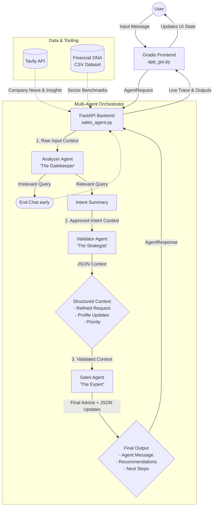
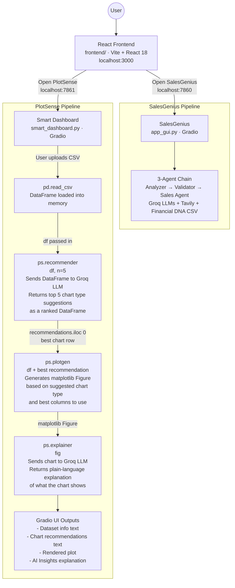

# Sales Intelligence Agent - System Architecture

This document visualizes the multi-agent architecture and data flow of the Sales Intelligence Agent system.

## High-Level Architecture

The system follows a sequential multi-agent orchestration pattern where each agent has a specific role, culminating in a highly refined response for the user.

## Agent Roles & Responsibilities

### 1. Analyzer (Gatekeeper)
- **Model**: `llama-3.1-8b-instant` (Fast, low-latency)
- **Role**: Blocks small-talk and explicitly scopes the bounds of the conversation.
- **Output**: Returns either `[[[STOP]]]` for irrelevant content or a 1-sentence `INTENT SUMMARY` alongside `[[[PROCEED]]]` for valid queries.

### 2. Validator (Strategist)
- **Model**: `llama-3.1-8b-instant` (Fast formatting)
- **Role**: Consumes the Gatekeeper's intent summary, looks at the user's raw message, and structures the context into a rigorous JSON format.
- **Output**: Extracts data points to update the client's profile in the background and rewrites the user's request into a professional problem statement.

### 3. Sales Agent (The Expert Closer)
- **Model**: `llama-3.3-70b-versatile` (Heavy reasoning capability)
- **Role**: Uses the precise context from the Validator alongside sector financial benchmarks (`sme_financial_decision.csv`) and live data (`TavilyClient`) to generate a highly personalized, targeted response.
- **Output**: The conversational response displayed to the user, plus hidden JSON to drive UI suggestions (Recommendations and Next Steps).

## Data Normalization & Type Safety
To ensure resilience across multiple turns, the system intercepts all LLM output and enforces strict dictionary and list normalization before sending changes back to the Gradio UI State. By blocking raw Pydantic serialization of potentially contaminated memory buffers, the system avoids crashing during long dialogues.

## Full System — Frontend to Services

